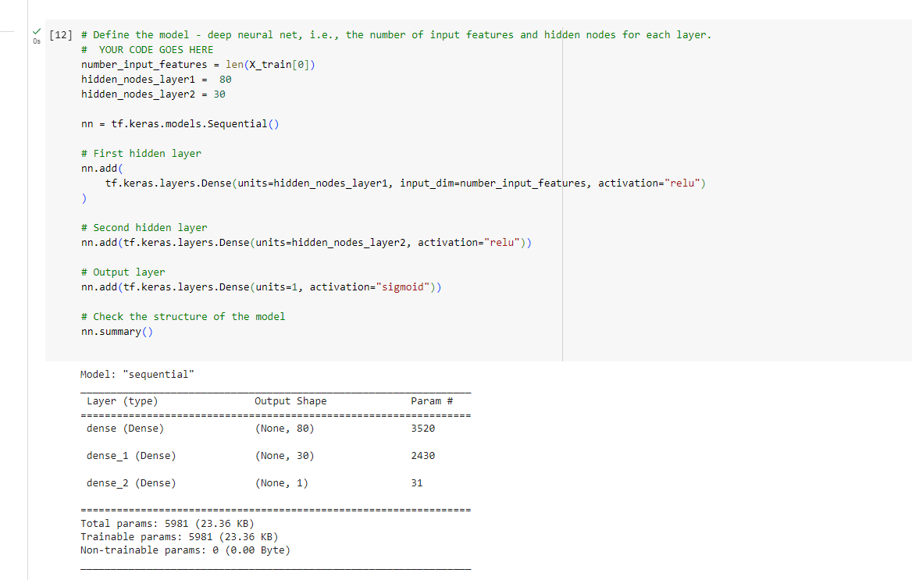

# deep-learning-challenge

## Report

### Overview

The overview of this analysis is to use machine learning and neural networks to create a binary classifier that can predict whether applicants will be successful if funded by Alphabet Soup.

### Result

- Data Preprocessing

  - The target variable for the model is "IS_SUCCESSFUL" column
  - The features variable for this model are
    - APPLICATION_TYPE
    - AFFILIATION
    - CLASSIFICATION
    - USE_CASE
    - ORGANIZATION
    - INCOME_AMT
    - ASK_AMT
    * STATUS
    * SPECIAL_CONSIDERATIONS

  * Variables that are removed are
    - NAME
    - EIN

### Compiling, Training, and Evaluating the Model

- The model has 2 layers, the first layer with 100 neurons and the second layer has 30 neurons, The activation model I used is "rectified linear units(relu) and sigmoid.I select relu and sigmoid because they give the best result after several attempts.
  

* No, I was unable to achieve the target performance.
* The steps I took is to increase rhe number of layers, the nuber of nuerons and the activation layers.

### Summary

- The model was able to predict an outcome with 72.5% accuracy. Though the accuracy is below 75% but it can still be considered as a good model, It has a loss of 0.55. When trying to optimized by removing some features from the independent variables and changing the hyperparameter the model the accuracy keep decreasing.

There are other models which can be used alternatively to nn model which can improve the accuracy by combinning two or other classifiers to make a more accurate and robust prediction engine, they are called Ensembles. one of them is Random Forest Algorithm called rf model. rf model improve accuracy and
robustness and decrease variance.A model with low accuracy is referred to as weak learners, rf model will combine weak learners to achieve an improve accuracy.
